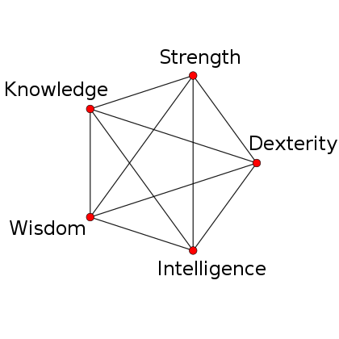

= Game system
Julien Bernard <julien.bernard@univ-fcomte.fr>
v0.5
:toc:
:homepage: https://akagoria.github.io/
:stem: latexmath
:source-highlighter: coderay
:xrefstyle: full

This document describes the game system in Akagoria.

== Main character: Kalista

=== Attributes

The main character has 5 link:https://en.wikipedia.org/wiki/Attribute_(role-playing_games)[attributes]

- Strength (STR)
- Dexterity (DEX)
- Intelligence (INT)
- Wisdom (WIS)
- Knowledge (KNO)

Each attribute has two sibling attributes and two opposed attributes. For example, Strength is opposed to Intelligence and Wisdom.

.Attributes of the main character

All attributes start at 50% and cannot go above 100% or beyond 10%. When an attribute is used (through its associated skills, see <<skills>>), it is enhanced and its two opposed attributes are reduced. The siblings attributes are unchanged. More precisely, if an attribute receives stem:[x] points, then stem:[\frac{x}{2}] points are taken from its two opposed attributes. As a consequence, the total points for all the attributes remains the same: 250%.

=== Conditions

- Health
- Magic
- Vitality

[[skills]]
=== Skills

==== Melee combat

Attribute: *Strength*

===== Swords, axes

Melee weapons (swords, axes, knifes, ...) have the following properties:

- ATK: the attack power
- Required strength: the minimum strength needed to use the weapon
- VP: The number of Vitality point
- Cooldown: the time after which the weapon is ready

===== Shields

Shields have the following properties:

- DEF: the defense power
- Required strength: the minimum strength needed to use the weapon
- VP: The number of Vitality point

==== Distance combat

Attribute: *Dexterity*

===== Bows, crossbows

Ranged weapons (bows, crossbows, ...) have the following properties:

- Range: the maximum distance of the target
- Angle: the maximum deviation of the arrow to reach the target
- Required dexterity: the minimum dexterity needed to use the weapon
- Cooldown: the time after which the weapon is ready

Projectiles (arrows, bolts, ...) have the following properties:

- ATK: the attack power
- VP: The number of Vitality point

==== Magic spells

Attribute: *Intelligence*

The user has to find _books_ in order to learn the spells.

===== Elemental spells

Elemental spells (fire, ice, lightning, ...) have the following properties:

- ATK: the attack power
- MP: the number of magic points
- Required intelligence: the minimum intelligence needed to use the spell

===== Protection spells

Protection spells (barrier, ...) have the following properties:

- DEF: the defense power
- MP: the number of magic points
- Required intelligence: the minimum intelligence needed to use the spell

==== Magic incantation

Attribute: *Wisdom*

The user has to find _parchments_ in order to learn incantations.

===== Alteration spells

Alteration spells (disease, curse, malediction, lethargy, ...) have the following properties:

- ATK: the attack power
- MP: the number of magic points
- Required wisdom: the minimum wisdom needed to use the spell

===== Enhancement spells

Enhancement spells (cure, double vitality, double health, ...) have the following properties:

- Effect: the effect of the spell
- MP: the number of magic points
- Required wisdom: the minimum wisdom needed to use the spell

==== Alchemy

Attribute: *Knowledge*

The character has to collect _ingredients_ and _recipes_ in order to be able to craft explosives and potions with the cauldron.

A recipe has the following properties:

- Required knowledge: the minimum knowledge required to use the recipe

===== Explosive crafting

Explosives (grenade, fireball, ...) have the following properties:

- ATK: the attack power
- VP: The number of Vitality point

===== Potion crafting

Potions (health potion,  magic potion, ...) have the following properties:

- Effect: the effect of the potion

=== Experience

Experience is gained by absorbing dark power, in Shrines of Ike. A certain amount of experience corresponds to a level stem:[L].

== NPCs and monsters

== Action resolution

=== Combat resolution

. Check if the attack is valid
.. Check if the remaining associated points are high enough
.. Check if the associated skill stem:[S] is high enough
. Compute success of the action
.. Choose a random number stem:[R] between 0 and 100
.. If stem:[R \leq S], the action is successful otherwise the action is _failed_
.. Compute the extent of success: stem:[E = 1 + \frac{S - R}{100}]
. Compute power of the attack
.. Compute the offensive points: stem:[\text{ATK} \times E \times \sqrt{L}]
. Compute power of the defense
.. Compute the defensive points: stem:[\text{DEF} \times \sqrt{L}]
.. If the defensive points are larger than the offensive points, then the action is _missed_
. Compute the damage
.. The damage corresponds to: stem:[ATK \times E]

=== Crafting

